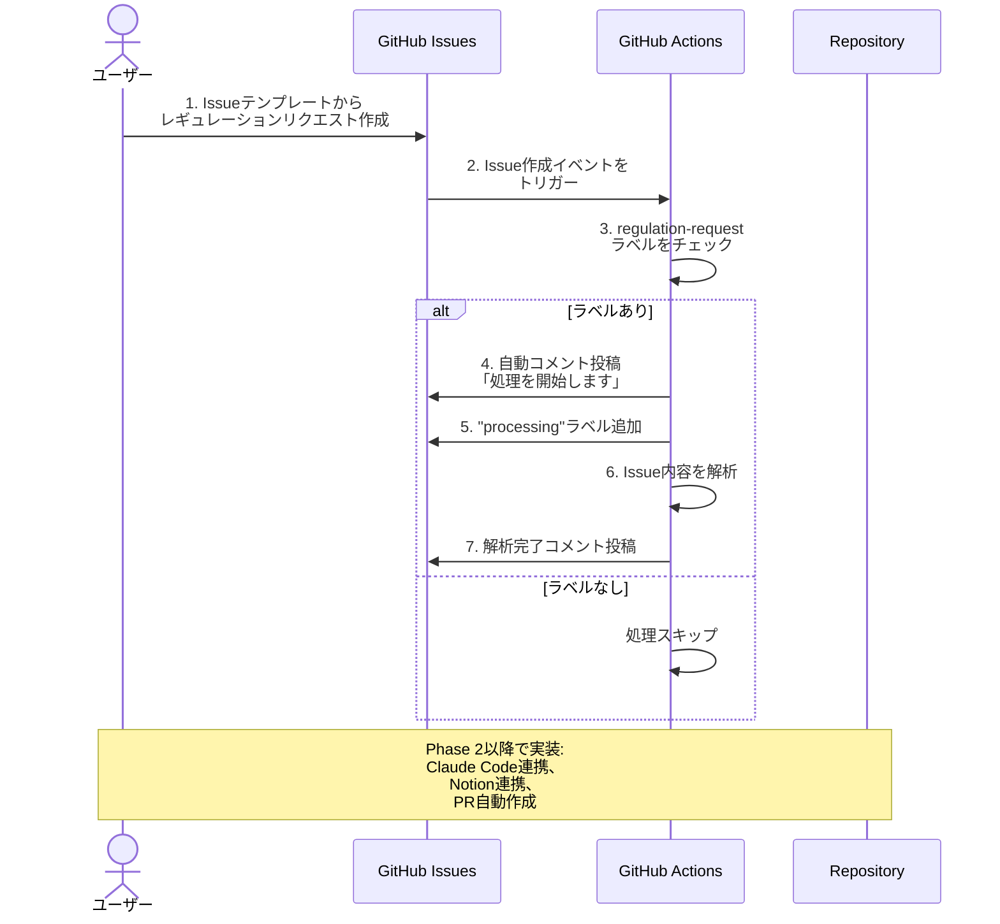
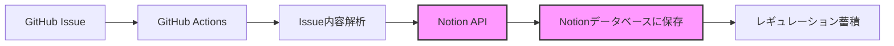

# Phase 1 完了レポート 🎉

## ✅ 実装完了項目

### 1. プロジェクト基盤
- [x] リポジトリ構造の設計
- [x] README.md の作成
- [x] セットアップガイドの作成

### 2. GitHub Issues連携
- [x] Issue テンプレート（regulation-request.yml）
- [x] 自動応答ワークフロー（issue-handler.yml）
- [x] ラベル自動付与機能

### 3. ドキュメント基盤
- [x] レギュレーションテンプレート
- [x] サンプルレギュレーション（ボタン使い分け）

## 📁 作成されたファイル一覧

```
Building-a-Scalable-DesignSystem/
├── .github/
│   ├── workflows/
│   │   └── issue-handler.yml           # Issue処理の自動化
│   └── ISSUE_TEMPLATE/
│       └── regulation-request.yml      # レギュレーションリクエストフォーム
│
├── docs/
│   ├── regulations/
│   │   └── button-usage.md            # サンプル: ボタン使い分け
│   ├── templates/
│   │   └── regulation-template.md     # レギュレーションテンプレート
│   └── phase1-setup-guide.md          # Phase 1 セットアップガイド
│
└── README.md                           # プロジェクト概要
```

## 🏗️ Phase 1 システム動作フロー



## 🎯 Phase 1 で実現できたこと

### 1. テンプレート駆動のIssue作成
- 構造化されたフォームで必要情報を収集
- 必須項目の設定でデータ品質を担保
- カテゴリー、優先度などの標準化

### 2. 自動化の基盤構築
- GitHub Actionsによるイベント駆動処理
- Issue作成時の自動応答
- ラベル管理の自動化

### 3. ドキュメント構造の確立
- レギュレーションの標準フォーマット
- メタ情報の管理方法
- チェックリストと実装例の形式

## 📊 技術スタック（Phase 1）

| 技術 | 用途 | 学習ポイント |
|-----|------|------------|
| **GitHub Issues** | リクエスト管理 | イシュー駆動開発 |
| **GitHub Actions** | CI/CD自動化 | YAML設定、ワークフロー |
| **GitHub Script** | API操作 | JavaScriptでのGitHub API |
| **Markdown** | ドキュメント | 技術文書の書き方 |

### Rails学習との接続ポイント

GitHub Actionsのワークフローは、Railsの以下の概念と似ています：

```ruby
# Railsのコールバック（類似概念）
class Regulation < ApplicationRecord
  after_create :send_notification
  after_create :add_processing_label
  
  def send_notification
    # GitHub Actionsの自動コメント投稿に相当
    NotificationMailer.new_regulation(self).deliver_later
  end
  
  def add_processing_label
    # GitHub Actionsのラベル追加に相当
    self.labels << Label.find_by(name: 'processing')
  end
end
```

## 🚀 次のステップ: Phase 2

Phase 2では、Notion連携を実装します。

### Phase 2 で実装する機能



### 必要な準備

1. **Notion アカウント**
   - ワークスペースの作成
   - データベースの作成

2. **Notion API キー**
   - Integration の作成
   - データベースへのアクセス権限付与

3. **GitHub Secrets 設定**
   - `NOTION_API_KEY`
   - `NOTION_DATABASE_ID`

### Phase 2 実装内容（予定）

- [ ] Notion データベース構造の設計
- [ ] Notion API連携スクリプトの作成
- [ ] GitHub Actions からの Notion 書き込み
- [ ] レギュレーションメタデータの同期
- [ ] エラーハンドリングとリトライ処理

## 📝 Phase 1 を通じて学べたこと

### GitHub Actionsの基礎
- ワークフローの構造（triggers, jobs, steps）
- GitHub Script による API操作
- 権限管理（permissions）

### イベント駆動アーキテクチャ
- Issueイベントをトリガーにした処理
- 非同期処理の考え方
- ステートマシンの概念

### CI/CDの実践
- 自動化の設計思想
- YAMLによる宣言的設定
- ログとデバッグ方法

## 💡 Tips & 学習リソース

### GitHub Actions を深く学ぶ

1. **公式ドキュメント**
   - [GitHub Actions入門](https://docs.github.com/ja/actions/learn-github-actions)
   - [ワークフローの構文](https://docs.github.com/ja/actions/using-workflows/workflow-syntax-for-github-actions)

2. **実践的な例**
   - [GitHub Actions のサンプル集](https://github.com/sdras/awesome-actions)
   - [GitHub Script の使い方](https://github.com/actions/github-script)

3. **Rails開発者向け**
   - GitHub ActionsでのRailsテスト自動化
   - Herokuへの自動デプロイ設定
   - RuboCopの自動実行

### 次に学ぶべきこと（Phase 2に向けて）

- [ ] REST APIの基礎（Notion API で使用）
- [ ] JSON データの扱い方
- [ ] 環境変数とシークレット管理
- [ ] エラーハンドリング

## 🎓 エンジニアとのコミュニケーションTips

このPhase 1を実装したことで、エンジニアと以下のような会話ができるようになります：

### Before（Phase 1実装前）
❌ 「自動化できたらいいですね」
❌ 「何か良い方法ありませんか？」

### After（Phase 1実装後）
✅ 「GitHub Actions のワークフローで、Issue作成をトリガーに自動化できます」
✅ 「権限は read/write で、github-script を使ってコメント投稿しています」
✅ 「ラベルのフィルタリングで、特定のIssueだけ処理しています」

**専門用語を理解し、具体的な実装方法を提案できる**ことがエンジニアとの円滑なコミュニケーションの鍵です！

## 📸 スクリーンショット（実装時に追加予定）

実際にGitHubにプッシュして動作確認したら、以下のスクリーンショットを撮ると良いでしょう：

- [ ] Issueテンプレート選択画面
- [ ] 入力フォーム画面
- [ ] 自動コメントが投稿された様子
- [ ] Actions タブのワークフロー実行結果
- [ ] 成功したジョブのログ

## ✅ Phase 1 完了確認

以下を確認してPhase 1を完了としましょう：

- [ ] すべてのファイルがGitHubにプッシュされている
- [ ] Issueテンプレートが正しく表示される
- [ ] テストIssueで自動応答が動作した
- [ ] セットアップガイドを読んで理解できた
- [ ] GitHub Actionsの基本概念を理解した

---

## 🎉 お疲れ様でした！

Phase 1の実装が完了しました。この基盤の上に、Phase 2でNotion連携、Phase 3でClaude Code統合を積み上げていきます。

**準備ができたらPhase 2に進みましょう！** 🚀
