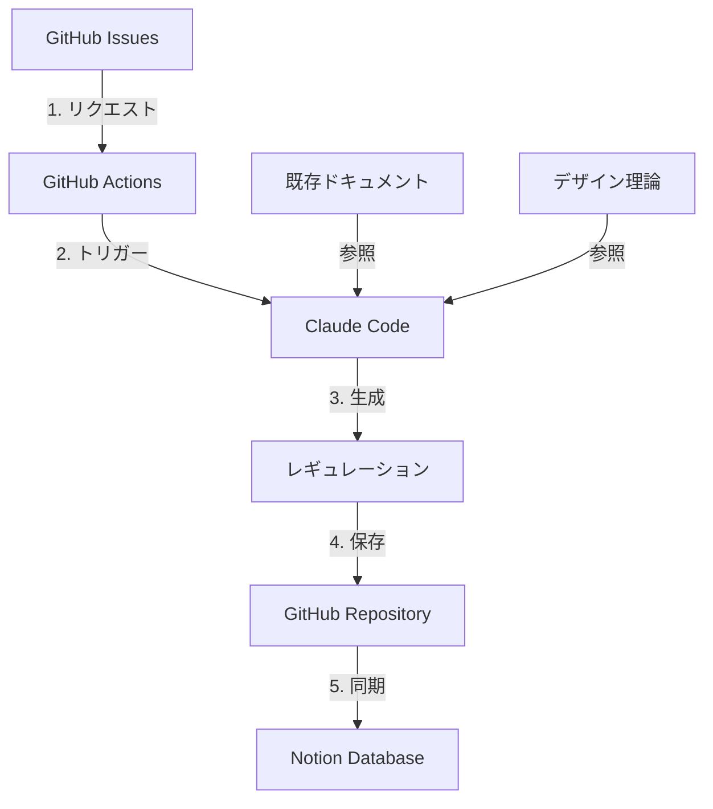

# はじめに

デザインシステムの運用で、こんな課題を感じたことはありませんか？

- 📝 ドキュメントが更新されず古くなっていく
- 🤔 ルールが曖昧で、チーム内で解釈が分かれる
- ⏰ レギュレーション作成に時間がかかる
- 🔍 過去のドキュメントを探すのが大変

この記事では、**GitHub Issues、Claude Code、Notionを組み合わせて、自動的にレギュレーションを生成・管理するシステム**を構築した過程をご紹介します。

## 🎯 この記事のゴール

- GitHub Actionsを使った自動化の基礎が理解できる
- Notion APIの使い方がわかる
- Claude Codeとの連携方法を学べる
- 実際に動くシステムを自分で構築できる

## 🏗️ システム全体像

[システム図をここに挿入]



### 主要コンポーネント

| コンポーネント | 役割 |
|--------------|------|
| **GitHub Issues** | レギュレーションリクエストの受付 |
| **GitHub Actions** | 自動化処理のオーケストレーション |
| **Claude Code** | レギュレーション文書の生成 |
| **Notion** | ナレッジベースとしての永続化 |

## 📦 技術スタック

- GitHub Issues & Actions
- Notion API
- Claude Code
- Markdown/MDX
- YAML

---

# Phase 1: GitHub ActionsとIssueテンプレート

## 実装内容

まずは自動化の基盤を作ります。

### 1. Issueテンプレートの作成

構造化されたフォームで、必要な情報を漏れなく収集します。

```yaml
# .github/ISSUE_TEMPLATE/regulation-request.yml
name: 📋 レギュレーション追加リクエスト
description: 新しいデザインレギュレーションの追加をリクエストします

body:
  - type: input
    id: regulation-title
    attributes:
      label: レギュレーションのタイトル
      placeholder: 例）プライマリボタンとセカンダリボタンの使い分け
    validations:
      required: true
  
  # ... 他のフィールド
```

### 2. GitHub Actionsワークフローの作成

Issueが作成されたら、自動で処理を開始します。

```yaml
# .github/workflows/issue-handler.yml
name: レギュレーションリクエスト処理

on:
  issues:
    types: [opened]

permissions:
  issues: write
  contents: write
  pull-requests: write

jobs:
  auto-response:
    if: contains(github.event.issue.labels.*.name, 'regulation-request')
    runs-on: ubuntu-latest
    
    steps:
      - name: 自動返信
        uses: actions/github-script@v7
        with:
          script: |
            await github.rest.issues.createComment({
              owner: context.repo.owner,
              repo: context.repo.repo,
              issue_number: context.payload.issue.number,
              body: '🤖 処理を開始します...'
            });
```

### 学んだこと

#### GitHub Actionsの基礎

- **トリガー**: `on:` でイベントを指定
- **ジョブ**: 並列・直列で実行可能
- **ステップ**: 各ジョブ内の処理単位

#### Railsとの類似性

GitHub Actionsは、Railsのコールバックと似た概念です：

```ruby
# Railsのafter_createコールバック
class Regulation < ApplicationRecord
  after_create :send_notification
end

# ↑これと似ている↓

# GitHub Actionsのトリガー
on:
  issues:
    types: [opened]
```

---

# Phase 2: Notion連携

## Notion APIのセットアップ

### 1. Notionインテグレーションの作成

[スクリーンショット挿入予定]

```bash
# 必要な情報
NOTION_API_KEY=secret_xxxxx
NOTION_DATABASE_ID=xxxxx-xxxx-xxxx
```

### 2. データベース構造の設計

| プロパティ | 型 | 説明 |
|-----------|---|------|
| タイトル | Title | レギュレーション名 |
| カテゴリー | Select | コンポーネント、カラーなど |
| ステータス | Status | Draft / Review / Approved |
| GitHub Issue | URL | 関連Issue |
| 作成日 | Date | 自動設定 |
| 内容 | Rich Text | レギュレーション本文 |

### 3. GitHub ActionsからNotionへ書き込み

```javascript
// Notion APIを使ったページ作成
const response = await notion.pages.create({
  parent: { database_id: NOTION_DATABASE_ID },
  properties: {
    'タイトル': {
      title: [{ text: { content: regulationTitle } }]
    },
    'カテゴリー': {
      select: { name: category }
    },
    // ...
  },
  children: [
    {
      object: 'block',
      type: 'paragraph',
      paragraph: {
        rich_text: [{ type: 'text', text: { content: content } }]
      }
    }
  ]
});
```

### 学んだこと

- Notion APIの認証方法
- データベースとページの関係
- Rich Textフォーマット
- エラーハンドリング

---

# Phase 3: Claude Code統合

## Claude Codeのセットアップ

### 1. ローカル環境でのClaude Code設定

```bash
# Claude Codeのインストール
# https://docs.claude.com/en/docs/claude-code

# プロジェクトディレクトリで初期化
claude init
```

### 2. レギュレーション生成プロンプト

```markdown
# プロンプトテンプレート

あなたはデザインシステムの専門家です。
以下の情報をもとに、新しいレギュレーションドキュメントを作成してください。

## リクエスト内容
- タイトル: {title}
- カテゴリー: {category}
- 背景: {background}
- 課題: {current_issue}

## 参考にするドキュメント
{existing_docs}

## 出力フォーマット
[テンプレートに従った形式]
```

### 3. GitHub Actionsとの統合

```yaml
jobs:
  generate-regulation:
    steps:
      - name: Claude Codeでレギュレーション生成
        run: |
          claude generate regulation \
            --template ./docs/templates/regulation-template.md \
            --input issue-data.json \
            --output ./docs/regulations/new-regulation.md
```

### 学んだこと

- Claude Codeのコマンドライン操作
- プロンプトエンジニアリング
- 既存ドキュメントの参照方法
- 生成物の品質管理

---

# Phase 4: 整合性チェックと承認フロー

## PRの自動作成

```yaml
jobs:
  create-pr:
    steps:
      - name: プルリクエスト作成
        uses: peter-evans/create-pull-request@v5
        with:
          commit-message: "Add regulation: {title}"
          title: "📋 新しいレギュレーション: {title}"
          body: |
            ## 概要
            Issue #{issue_number} からの自動生成
            
            ## レビューポイント
            - [ ] 既存レギュレーションと矛盾していないか
            - [ ] 実装例は適切か
            - [ ] チェックリストは十分か
```

## レビューフロー

1. 自動生成されたPRを確認
2. 必要に応じて手動で修正
3. 承認後マージ
4. Notionに自動反映

---

# 実際に使ってみた結果

## Before / After

### Before（手動運用）
- ⏱️ レギュレーション作成: 2-3時間
- 📝 ドキュメント更新率: 月1回程度
- 🔍 過去ドキュメント検索: 10分以上

### After（自動化後）
- ⏱️ レギュレーション作成: 5-10分
- 📝 ドキュメント更新率: 週2-3回
- 🔍 過去ドキュメント検索: 数秒

## チーム内の反応

- 「ドキュメント作成のハードルが下がった」
- 「Notionで一元管理できて便利」
- 「既存ルールとの整合性チェックが自動化されて助かる」

---

# トラブルシューティング

## よくある問題と解決法

### 1. GitHub Actionsが動かない

**原因**: 権限不足

**解決法**:
```
Settings > Actions > General
→ Workflow permissions
→ Read and write permissions
```

### 2. Notion APIでエラー

**原因**: データベースIDが間違っている

**解決法**:
- NotionのデータベースURLから正しいIDを取得
- `https://notion.so/xxxxx` の `xxxxx` 部分

### 3. Claude Codeの生成物が期待と違う

**原因**: プロンプトが不明確

**解決法**:
- テンプレートを詳細化
- 既存ドキュメントを増やす
- Few-shot examplesを追加

---

# まとめ

## 構築してわかったこと

✅ **自動化は段階的に**
- いきなり完璧を目指さない
- Phase 1, 2, 3と段階的に拡張

✅ **テンプレート設計が重要**
- 生成物の品質はテンプレート次第
- 継続的な改善が必要

✅ **レビューフローは必須**
- 完全自動化は危険
- 人間のレビューを残す

## 今後の展開

- [ ] デザイントークンとの連携
- [ ] Figmaプラグイン開発
- [ ] Slackへの通知機能
- [ ] 定期的なレギュレーション監査

## コスト

- GitHub: 無料（Public repo）/ $4〜（Private）
- Notion: 無料〜$8/月
- Claude API: 従量課金
- **合計**: 月$10程度〜

## 参考リンク

- [プロジェクトリポジトリ](https://github.com/...)
- [GitHub Actions ドキュメント](https://docs.github.com/actions)
- [Notion API](https://developers.notion.com/)
- [Claude Code](https://docs.claude.com/claude-code)

---

# おわりに

このシステムを構築したことで、デザインシステムのドキュメント作成が劇的に効率化されました。

特に、**プロダクトデザイナーとしてエンジニアリングを学ぶ**という観点では：

- GitHub Actionsで自動化の考え方を学べた
- REST APIの扱い方が理解できた
- CI/CDの実践経験を積めた
- エンジニアとの会話で具体的な提案ができるようになった

もしあなたも同じような課題を感じているなら、ぜひ試してみてください！

質問やフィードバックがあれば、コメント欄かGitHub Issuesでお気軽にどうぞ 🙌

---

この記事が役に立ったら、いいね❤️やストック📚をお願いします！
